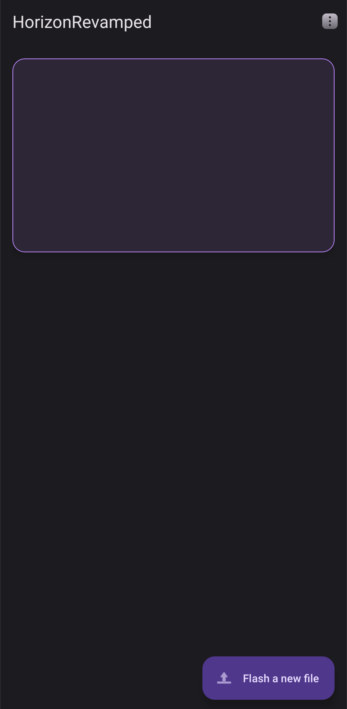
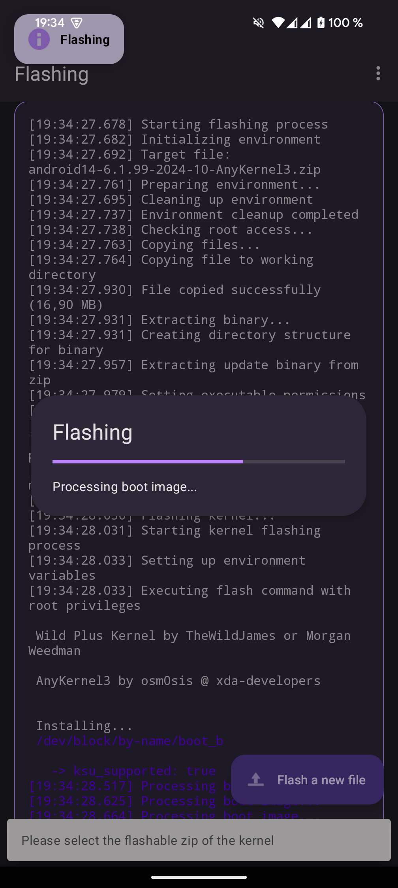
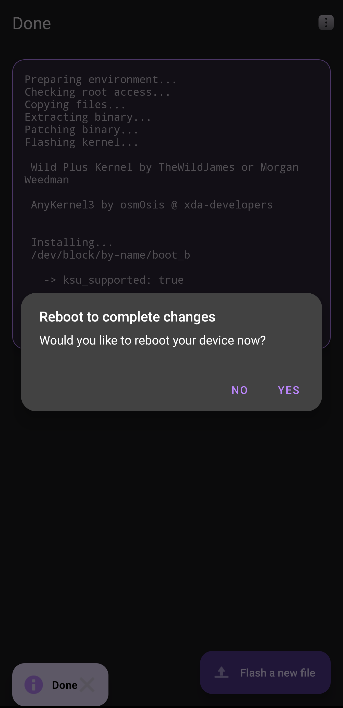
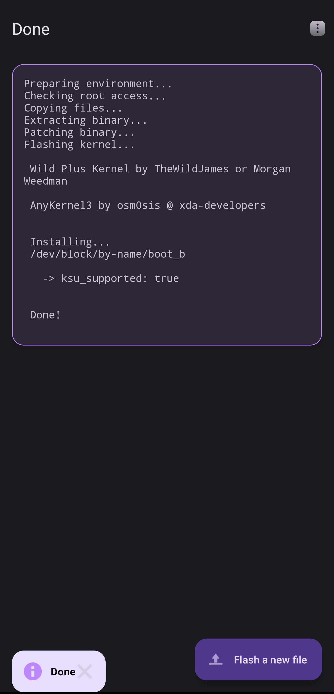

# HorizonRevamped 🚀

## About 📱

HorizonRevamped is a powerful and user-friendly Android application designed to flash [AnyKernel](https://github.com/osm0sis/AnyKernel3) flashable zips on Android devices. It provides a streamlined interface for kernel installation and management, making the process accessible to both beginners and advanced users.

## Features ✨

- 🔹 Material You design with dynamic theming
- 🔹 Smooth, refined animations
- 🔹 Support for all AnyKernel3 flashable zips
- 🔹 Root required for operation
- 🔹 Fast and efficient flashing process
- 🔹 Backup and restore functionality (WIP!)
- 🔹 Detailed logging for troubleshooting (WIP!)

## Media 📷

  
  
  
  
  

## Installation 📲

1. Download the latest release from the [Releases](https://github.com/YourUsername/HorizonRevamped/releases) page
2. Install the APK on your Android device
3. Grant necessary permissions when prompted

## Usage 🛠️

1. Launch the HorizonRevamped app
2. Select the AnyKernel zip file you want to flash
3. Follow the on-screen instructions
4. Reboot your device when prompted

## Requirements 📋

- 📱 Android 7.0 or higher
- 🔓 Unlocked bootloader
- ⚡ Root access (KernelSU, Magisk)

## Prebuilt Binaries 🧰

This project uses the following prebuilt binaries:

- [mkbootfs](https://github.com/libxzr/mkbootfs)

## Contributing 👥

Contributions are welcome! Please feel free to submit a Pull Request.

## License 📄

This project is licensed under the terms found in the [LICENSE](LICENSE) file.

## Credits 🙏

Special thanks to the original [HorizonKernelFlasher](https://github.com/libxzr/HorizonKernelFlasher) developer for the inspiration and foundation of this project.
